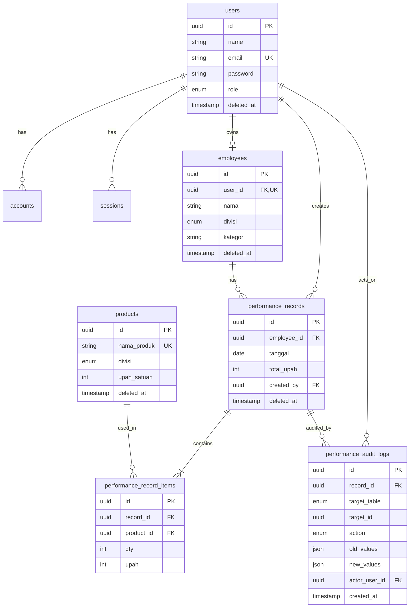

# Aquarium Performance ERD

```mermaid
erDiagram
  users ||--o{ accounts : has
  users ||--o{ sessions : has
  users ||--o| employees : owns
  users ||--o{ performance_records : creates
  users ||--o{ performance_audit_logs : acts_on

  employees ||--o{ performance_records : has
  performance_records ||--|{ performance_record_items : contains
  products ||--o{ performance_record_items : used_in
  performance_records ||--o{ performance_audit_logs : audited_by

  users {
    uuid id PK
    string name
    string email UK
    string password
    enum role
    timestamp deleted_at
  }

  employees {
    uuid id PK
    uuid user_id FK,UK
    string nama
    enum divisi
    string kategori
    timestamp deleted_at
  }

  products {
    uuid id PK
    string nama_produk UK
    enum divisi
    int upah_satuan
    timestamp deleted_at
  }

  performance_records {
    uuid id PK
    uuid employee_id FK
    date tanggal
    int total_upah
    uuid created_by FK
    timestamp deleted_at
  }

  performance_record_items {
    uuid id PK
    uuid record_id FK
    uuid product_id FK
    int qty
    int upah
  }

  performance_audit_logs {
    uuid id PK
    uuid record_id FK
    enum target_table
    uuid target_id
    enum action
    json old_values
    json new_values
    uuid actor_user_id FK
    timestamp created_at
  }
```
